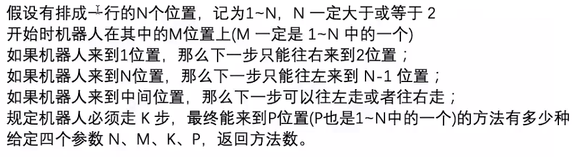
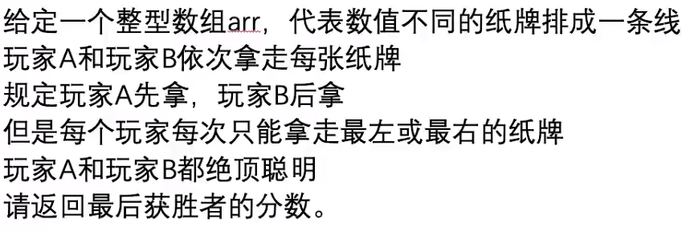

## 动态规划题目特点

1. 计数类型
>
> - 有多少种方式走到某个地方
> - 有多少种方法选出k个数使得和是Sum
>
2. 求最大最小值类型
>
> - 从某处走到某处路径的最大数字和
> - 最长上升子序列长度
>
3. 求存在性类型
>
> - 取石子游戏，先手是否必胜
> - 能不能选出k个数使得和是Sum

## 题目

### 1. 计数类型的例题



> (1) 正常思维实现的暴力递归

 ``` C++
 #include<bits/stdc++.h>
 
 using namespace std;
 
 // =================================================
 
 // 当前位置为cur
 // 还剩rest步需要走
 // 目标是aim
 // 共有n个位置
 int process1(int cur,int rest,int aim,int n)
 {
     if(rest==0){ //rest等于0，说明不需要走了
         // 如果当前位置等于我的目标位置，则说明找到一种方法，否则没有找到
         return cur == aim ? 1 : 0;
     }
     // rest > 2的情况
     if(cur == 1){ // 当前位置在1上，则只能1->2，并且，1上走到aim的方法数就等于2走到aim的方法数。
         return process1(2,rest-1,aim,n);
     }
     if(cur == n){ // 当前位置在n上，则只能n-1 <- n,并且当前的走到aim的方法数就等于n-1走到aim的方法数
         return process1(n-1,rest-1,aim,n);
     }
     return process1(cur-1,rest-1,aim,n) + process1(cur+1,rest-1,aim,n);
 }
 
 int way1(int M,int K,int P,int N){
     return process1(M,K,P,N);
 }
 
 int main()
 {
     int N,M,K,P;
     cin>>N>>M>>K>>P;
     cout<< process1(M,K,P,N)<<endl;
     return 0;
 }
 ```  

> &nbsp; &nbsp; &nbsp; &nbsp;依据常规正常思维实现的暴力递归，我们可以看出，程序执行过程中，做了很多的重复函数调用，因此，该算法可以通过缓存法进行优化

 (2) 记忆化搜索实现优化 (缓存法)

 ```C++
 #include<bits/stdc++.h>
 
 using namespace std;
 
 // =====================================
 // 缓存表
 int dp1[105][105];
 int process2(int cur,int rest,int aim,int n)
 {
     // 如果之前已经算过，直接返回值
     if(dp1[cur][rest] != -1){
         return dp1[cur][rest];
     }
     // 没有算过
     int ans = 0;
     if(rest==0){
         ans = (cur == aim ? 1 : 0);
     }else if(cur == 1){
         ans = process2(2,rest-1,aim,n);
     }else if(cur == n){
         ans = process2(n-1,rest-1,aim,n);
     }else{
         ans = process2(cur-1,rest-1,aim,n) + process2(cur+1,rest-1,aim,n);
     }
     // 返回之前，将ans存入缓存表
     dp1[cur][rest] = ans;
     return ans;
 }
 
 // cur : 1-N
 // rest : 0-K
 int way2(int M,int K,int P,int N){
     // dp就是一张缓存表
     // dp[cur][rest] == -1  ---> 说明 process2(cur,rest)没有算过
     // dp[cur][rest] != -1  ---> 说明 process2(cur,rest)已经计算过了
     // 当计算process2(cur,rest)，如果dp[cur][rest] != -1 ,则不用计算，直接返回dp[cur][rest];
     // 反之，在返回process2(cur,rest)之前，记录值，即dp[cur][rest] = res;
     for(int i=0;i<=N;i++){
         for(int j=0;j<=K;j++){
            dp1[i][j] = -1;
         }
     }
     return process2(M,K,P,N);
 }
 
 int main()
 {
     int N,M,K,P;
     cin>>N>>M>>K>>P;
     cout<< way2(M,K,P,N)<<endl;
 
     return 0;
 }
 ```

> &nbsp; &nbsp; &nbsp; &nbsp;针对上述的记忆化搜索过程中，对dp数组进行展开，可以发现数组赋值具有如下规律：

- $dp[aim][0] = 1;$
- $dp[1][rest] = dp[2][rest-1];$
- $dp[n][rest] = d[n-1][rest-1];$
- $dp[cur][rest] = dp[cur-1][rest-1] + dp[cur+1][rest-1];$
因此我们就可以得到最终的动态规划

(3) 最终版本的动态规划

```C++
#include<bits/stdc++.h>

using namespace std;
int way3(int M,int K,int P,int N)
{
    int dp[105][105];
    for(int i=0;i<=N;i++){
        for(int j=0;j<=K;j++){
            dp[i][j] = 0;
        }
    }
    dp[P][0] = 1;
    for(int rest=1;rest<=K;rest++){
        dp[1][rest] = dp[2][rest-1];
        for(int cur = 2;cur < N;cur++){
            dp[cur][rest] = dp[cur-1][rest-1] + dp[cur+1]> [rest-1];
        }
        dp[N][rest] = dp[N-1][rest-1];
    }
    return dp[M][K];
}
int main()
{

    int N,M,K,P;
    cin>>N>>M>>K>>P;
    // M:4,K:2,P:4,N:4
    cout<< way3(M,K,P,N)<<endl;
    return 0;
}
```

### 2. 存在性类型的例题


(1) 常规思维实现暴力递归进行求解

```C++
#include<bits/stdc++.h>

using namespace std;

int f1(int arr[],int L,int R);
int g1(int arr[],int L,int R);
int win1(int arr[],int len);
int main()
{
    int arr[] = {5,7,4,5,8,1,6,0,3,4,6,1,7};
    cout<<win1(arr,13)<<endl;
    return 0;
}
int f1(int arr[],int L,int R)
{
    // 当L==R时，说明只剩一张牌了，此时又作为先手，可以直接返回该牌面值
    if(L==R)
    {
        return arr[L];
    }
    // 分别计算拿左边的牌后的得分p1和拿右边牌后的得分p2
    // 拿左边牌的得分等于 左边牌的牌面 + 后手再拿牌之后的牌面得分(后手拿牌的范围就在L+1->R之间)
    int p1 = arr[L] + g1(arr,L+1,R);
    // 拿右边牌的得分等于 右边牌的牌面 + 后手再拿牌之后的牌面得分(后手拿牌的范围就在L->R-1之间)
    int p2 = arr[R] + g1(arr,L,R-1);
    // 游戏规则是，先手的取牌需要考虑两种情况得到的最优解，因此返回两种情况的最大值
    return max(p1,p2);
}

int g1(int arr[],int L,int R)
{
    // 后手情况下只剩一张牌，此时是先手拿牌，后手不能拿到这剩下的牌，因此牌面返回0
    if(L==R)
    {
        return 0;
    }
    // 分别计算后手拿左边的牌后的得分p1和拿右边牌后的得分p2
    // 后手有两种情况：
    // 先手已经把L上位置的牌拿走了，因此，后手在L+1->R上是以先手的姿态进行得分
    int p1 = f1(arr,L+1,R);
    // 先手已经把R上位置的牌拿走了，因此，后手在L->R-1上是以先手的姿态进行得分
    int p2 = f1(arr,L,R-1);
    // 但游戏规则是，先手会尽可能让后手得到的分值最少，
    // 因此后手情况下，返回的是两种情况的最小值
    return min(p1,p2);
}

int win1(int arr[],int len)
{
    int first = f1(arr,0,len-1);
    int second = g1(arr,0,len-1);
    return max(first,second);
}
```

> 上述的两个递归函数存在重复调用的过程，因此可以使用缓存表进行优化

(2) 记忆化搜索(缓存法)进行优化

```C++
#include<bits/stdc++.h>

using namespace std;

int f2(int arr[],int L,int R,int **fmp,int **gmp);
int g2(int arr[],int L,int R,int **fmp,int **gmp);
int win2(int arr[],int len);

int f2(int arr[],int L,int R,int **fmp,int **gmp)
{
    // 如果已经计算过了，直接返回数组中的值
    if(fmp[L][R] != -1)
    {
        return fmp[L][R];
    }
    int ans = 0;
    if(L==R)
    {
        ans = arr[L];
    }else{
        int p1 = arr[L] + g2(arr,L+1,R,fmp,gmp);
        int p2 = arr[R] + g2(arr,L,R-1,fmp,gmp);
        ans = max(p1,p2);
    }
    // 返回之前，对数组进行赋值
    fmp[L][R] = ans;
    return ans;

}
int g2(int arr[],int L,int R,int **fmp,int **gmp)
{
    if(gmp[L][R] != -1)
    {
        return gmp[L][R];
    }
    int ans = 0;
    if(L!=R){
        int p1 = f2(arr,L+1,R,fmp,gmp);
        int p2 = f2(arr,L,R-1,fmp,gmp);
        ans = min(p1,p2);
    }
    gmp[L][R] = ans;
    return ans;
}
int win2(int arr[],int len)
{
    // 动态开辟空间
    int **fmp;
    int **gmp;
    fmp = new int*[len];
    gmp = new int*[len];
    for(int i=0;i<len;i++){
        fmp[i] = new int[len];
        gmp[i] = new int[len];
    }
    // 如果没有计算过，则数组默认为-1
    for(int i=0; i<len; i++)
    {
        for(int j=0;j<len;j++){
            fmp[i][j] = -1;
            gmp[i][j] = -1;
        }
    }
    int first = f2(arr,0,len-1,fmp,gmp);
    int second = g2(arr,0,len-1,fmp,gmp);
    return max(first,second);
}

int main()
{
    int arr[] = {5,7,4,5,8,1,6,0,3,4,6,1,7};

    cout<<win2(arr,13)<<endl;
    return 0;
}
```

> 针对上述优化的两张缓存表，进行展开分析，可以得到如下规律：
>
> - i = 0 -> N,fmp[i][i] = arr[i];
> - i = 0 -> N,gmp[i][i] = arr[i];
> - 以对角线为基准，其余位置的值：
> - fmp[L][R] = max(arr[L] + gmp[L+1][R],arr[R] + gmp[L][R-1]);
> - gmp[L][R] = min(fmp[L+1][R],fmp[L][R-1]);

(3) 最终动态规划代码

```C++
#include<bits/stdc++.h>
using namespace std;
int win3(int arr[],int len);
int main()
{
    int arr[] = {5,7,4,5,8,1,6,0,3,4,6,1,7};
    cout<<win3(arr,13)<<endl;
    return 0;
}

int win3(int arr[],int len){
    int **fmp;
    int **gmp;
    fmp = new int*[len];
    gmp = new int*[len];

    for(int i=0;i<len;i++){
        fmp[i] = new int[len];
        gmp[i] = new int[len];
    }

    for(int i=0;i<len;i++){
        fmp[i][i] = arr[i];
    }

    for(int i=1;i<len;i++){
        int L = 0;
        int R = i;
        // 以对角线为基准，进行赋值
        while(R<len){
            fmp[L][R] = max(arr[L] + gmp[L+1][R],arr[R] + gmp[L][R-1]);
            gmp[L][R] = min(fmp[L+1][R],fmp[L][R-1]);
            L++;
            R++;
        }
    }
    return max(fmp[0][len-1],gmp[0][len-1]);
}
```
