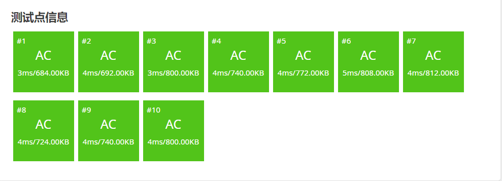

# 例题

## 1. 数字三角形 Number Triangles

**题目描述**

观察下面的数字金字塔。

写一个程序来查找从最高点到底部任意处结束的路径，使路径经过数字的和最大。每一步可以走到左下方的点也可以到达右下方的点。

```cpp
        7 
      3   8 
    8   1   0 
  2   7   4   4 
4   5   2   6   5 
```

在上面的样例中,从 $7 \to 3 \to 8 \to 7 \to 5$ 的路径产生了最大

**输入格式**

第一个行一个正整数 $r$ ,表示行的数目。

后面每行为这个数字金字塔特定行包含的整数。

**输出格式**

单独的一行,包含那个可能得到的最大的和。

**样例 #1**

**样例输入 #1**

```
5
7
3 8
8 1 0
2 7 4 4
4 5 2 6 5
```

**样例输出 #1**

```
30
```

**提示**

【数据范围】  
对于 $100\%$ 的数据，$1\le r \le 1000$，所有输入在 $[0,100]$ 范围内。

> 分析：从倒数第二行开始自下而上推，直到推到最顶层。mp\[i][j]的元素的左右位置关系如下：
> 左边: mp \[i+1]\[j] 右边: mp\[i+1][j+1]
> mp\[i][ j]元素的左右分支中最大和 = dp\[i][j] + max(dp\[i+1][j],dp\[i+1][j+1]);

```C++
#include<bits/stdc++.h>
using namespace std;
int dp[1005][1005];
int main()
{
    int n;
    cin>>n;
    for(int i=1;i<=n;i++){
        for(int j=1;j<=i;j++){
            cin>>dp[i][j];
        }
    }
    for(int i=n-1;i>=1;i--){
        for(int j=1;j<=i;j++){
            int p1 = dp[i+1][j];
            int p2 = dp[i+1][j+1];
            dp[i][j] += max(p1,p2);
        }
    }
    cout<<dp[1][1]<<endl;
    return 0;
}
```

## 2. 采药

**题目描述**

辰辰是个天资聪颖的孩子，他的梦想是成为世界上最伟大的医师。为此，他想拜附近最有威望的医师为师。医师为了判断他的资质，给他出了一个难题。医师把他带到一个到处都是草药的山洞里对他说：“孩子，这个山洞里有一些不同的草药，采每一株都需要一些时间，每一株也有它自身的价值。我会给你一段时间，在这段时间里，你可以采到一些草药。如果你是一个聪明的孩子，你应该可以让采到的草药的总价值最大。”

如果你是辰辰，你能完成这个任务吗？

**输入格式**

第一行有 $2$ 个整数 $T$（$1 \le T \le 1000$）和 $M$（$1 \le  M \le 100$），用一个空格隔开，$T$ 代表总共能够用来采药的时间，$M$ 代表山洞里的草药的数目。

接下来的 $M$ 行每行包括两个在 $1$ 到 $100$ 之间（包括 $1$ 和 $100$）的整数，分别表示采摘某株草药的时间和这株草药的价值。

**输出格式**

输出在规定的时间内可以采到的草药的最大总价值。

**样例 #1**

**样例输入 #1**

```
70 3
71 100
69 1
1 2
```

**样例输出 #1**

```
3
```

**提示**

**【数据范围】**

- 对于 $30\%$ 的数据，$M \le 10$；
- 对于全部的数据，$M \le 100$。

>> 分析：0-1背包问题，对每种药，有两个决策，选和不选，然后针对两个决策的结果，返回最大价值。(下述给出三种方法：暴力递归求解、记忆化搜索和动态规划)

(1) 暴力递归求解

```C++
#include<bits/stdc++.h>

using namespace std;

struct Node{
    int t,v;
}arrs[105];


int T,M;
int process(int index,int t){
    if(index > M){
        return 0;
    }
    // 做出两种决策：选和不选
    // 不选当前这个药
    int p1 = process(index+1,t);
    // 选这个药
    int p2 = 0;
    // 如果选了的话还有体力，我们就选，并进行下一个决策
    // 如果选了之后，没有体力了，那我们选个der，此时的决策就为0
    if(t-arrs[index].t >= 0){
        int next = process(index+1,t-arrs[index].t);
        p2 = arrs[index].v + next;
    }
    // 做出两种决策之后，返回两种决策的最大价值
    return max(p1,p2);
}

int main()
{
    cin>>T>>M;
    for(int i=1;i<=M;i++){
        cin>>arrs[i].t>>arrs[i].v;
    }
    cout<<process(1,T);

    return 0;
}
```

> 该算法和绝大多数的暴力递归一样具有很高的时间复杂度，因此，我们可以尝试进行一些适当的优化：（记忆化搜索）缓存法


(2)记忆化搜索

```C++
#include<bits/stdc++.h>

using namespace std;

struct Node{
    int t,v;
}arrs[105];
int T,M;
int dp[105][1005];
int processBt(int index,int t){
    // 如果已经计算过了，则直接返回dp表中的值
    if(dp[index][t] != -1){
        return dp[index][t];
    }
    // 如果没有计算过
    int ans = 0;
    if(index > M){
        dp[index][t] = ans;
        return ans;
    }
    int p1 = processBt(index+1,t);
    int p2 = 0;
    if(t-arrs[index].t >= 0){
        int next  = processBt(index+1,t-arrs[index].t);
        p2 = arrs[index].v + next;
    }
    ans = max(p1,p2);
    // 在返回之前，存入dp表中，便于下次使用
    dp[index][t] = ans;
    return ans;
}
int main()
{
    cin>>T>>M;
    // 初始化为-1，便于下次使用
    for(int i=1;i<=M;i++){
        for(int j=1;j<=T;j++){
            dp[i][j] = -1;
        }
    }

    for(int i=1;i<=M;i++){
        cin>>arrs[i].t>>arrs[i].v;
    }
    cout<<processBt(1,T)<<endl;
    return 0;
}
```


> 然而有时候记忆化搜索并不能保证时间复杂度变得合理，这种情况下，可以针对记忆化搜索中的代码而实现动态规划

(3) 动态规划

```C++
#include<bits/stdc++.h>

using namespace std;

struct Node{
    int t,v;
}arrs[105];

int T,M;
int dpn[105][1005];

int ans_dp(int ii,int tt){
    for(int index = M;index>=1;index--){
        for(int t = 0;t<=T;t++){
            int p1 = dpn[index+1][t];
            int p2 = 0;

            if(t-arrs[index].t >= 0){
                int next = dpn[index+1][t-arrs[index].t];
                p2 = arrs[index].v + next;
            }
            dpn[index][t] = max(p1,p2);

        }
    }
    return dpn[ii][tt];
}
int main()
{
    cin>>T>>M;
    for(int i=1;i<=M;i++){
        cin>>arrs[i].t>>arrs[i].v;
    }
    cout<<ans_dp(1,T)<<endl;
    return 0;
}
```



## 3. 五倍经验日

**题目描述**

现在 absi2011 拿出了 $x$ 个迷你装药物（嗑药打人可耻…），准备开始与那些人打了。

由于迷你装药物每个只能用一次，所以 absi2011 要谨慎的使用这些药。悲剧的是，用药量没达到最少打败该人所需的属性药药量，则打这个人必输。例如他用 $2$ 个药去打别人，别人却表明 $3$ 个药才能打过，那么相当于你输了并且这两个属性药浪费了。

现在有 $n$ 个好友，给定失败时可获得的经验、胜利时可获得的经验，打败他至少需要的药量。

要求求出最大经验 $s$，输出 $5s$。

**输入格式**

第一行两个数，$n$ 和 $x$。

后面 $n$ 行每行三个数，分别表示失败时获得的经验 $\mathit{lose}_i$，胜利时获得的经验 $\mathit{win}_i$ 和打过要至少使用的药数量 $\mathit{use}_i$。

**输出格式**

一个整数，最多获得的经验的五倍。

**样例 #1**

**样例输入 #1**

```
6 8
21 52 1
21 70 5
21 48 2
14 38 3
14 36 1
14 36 2
```

**样例输出 #1**

```
1060
```

**提示**

**【Hint】**

五倍经验活动的时候，absi2011 总是吃体力药水而不是这种属性药。

**【数据范围】**

- 对于 $10\%$ 的数据，保证 $x=0$。
- 对于 $30\%$ 的数据，保证 $0\le n\le 10$，$0\le x\le 20$。
- 对于 $60\%$ 的数据，保证 $0\le n,x\le 100$， $10<lose_i,win_i\le 100$，$0\le use_i\le 5$。
- 对于 $100\%$ 的数据，保证 $0\le n,x\le 10^3$，$0<lose_i\le win_i\le 10^6$，$0\le use_i\le 10^3$。

> 本题是0-1背包的变形题。每个人都要去打一遍，无论输赢，都有经验。给出人数n、每个人输赢后可以获得的经验和需要使用的药剂量、自身持有的药剂量。  
>
> - 面对第index个人时，我们有两种决策进行选择：选择输他和选择赢他
> - 当结局是输的时候，我们不使用任何药
> - 当结局是赢的时候，我们才使用尽可能少的药剂(两点均采用贪心策略)
> - 返回两种决策下的最大经验值

(1) 上述思路的暴力递归求解

```C++
#include<bits/stdc++.h>

using namespace std;

struct Node{
    int lose,win,use;
}arrs[1005];

int n,x;

int process(int index,int s){
    if(index>n){
        return 0;
    }
    // 要么赢 要么输 两种决策
    // 输（输的时候，不使用任何药,得到应该得到的经验）
    int p1 = arrs[index].lose + process(index+1,s);
    // 赢
    int p2 = 0;
    // 需要考虑自身的药剂量足够赢这个人，否则这个决策就是无效的
    if(s-arrs[index].use >= 0){
        p2 = arrs[index].win + process(index+1,s-arrs[index].use);
    }
    return max(p1,p2);
}
int main()
{
    cin>>n>>x;
    for(int i=1;i<=n;i++){
        cin>>arrs[i].lose>>arrs[i].win>>arrs[i].use;
    }
    // 返回五倍经验
    cout<<process(1,x)*5<<endl;
    return 0;
}
```

> 绝大多数的暴力递归，其时间复杂度都会很高，一般针对重复调用的地方，进行剪枝或缓存进行优化


(2) 记忆化搜索进行优化

```C++
#include<bits/stdc++.h>

using namespace std;

struct Node{
    int lose,win,use;
}arrs[1005];

int n,x;
// 缓存表（记录表）
long long dp1[1005][1005];

long long process(int index,int s){
    // 如果已经算过了 直接返回
    if(dp1[index][s] != -1){
        return dp1[index][s];
    }

    long long ans = 0;
    if(index>n){
        dp1[index][s] = ans;
        return ans;
    }
    // 要么赢 要么输 两种决策
    // 输（输的时候，不使用任何药,得到应该得到的经验）
    long long p1 = (long long)arrs[index].lose + process(index+1,s);
    // 赢（需要考虑当前药剂能否赢，否则 这个决策就是个无效决策，价值为0）
    long long p2 = 0;
    if(s-arrs[index].use >= 0){
        p2 = (long long)arrs[index].win + process(index+1,s-arrs[index].use);
    }
    // 返回之前，进行记录
    ans = max(p1,p2);
    dp1[index][s] = ans;
    return ans;
}

int main()
{
    cin>>n>>x;
    for(int i=1;i<=n;i++){
        cin>>arrs[i].lose>>arrs[i].win>>arrs[i].use;
    }
    for(int i=0;i<=n;i++){
        for(int j=0;j<=x;j++){
            dp1[i][j] = -1;
        }
    }
    cout<<process(1,x)*5<<endl;
    return 0;
}
```

> 注：数据类型改为long long，防止精度不够大。


(3) 动态规划求解
> 依据上述的记忆化搜索代码，可实现动态规划

```C++
#include<bits/stdc++.h>

using namespace std;

struct Node{
    int lose,win,use;
}arrs[1005];

int n,x;
long long dp[1005][1005];

long long ans_dp(int ii,int ss){
    for(int index=n;index>=1;index--){
        for(int s=0;s<=x;s++){
            long long p1 = (long long)arrs[index].lose + dp[index + 1][s];
            long long p2 = 0;
            if(s-arrs[index].use >= 0){
                p2 = (long long)arrs[index].win + dp[index+1][s-arrs[index].use];
            }
            dp[index][s] = max(p1,p2);
        }
    }
    return dp[ii][ss];
}

int main()
{
    cin>>n>>x;
    for(int i=1;i<=n;i++){
        cin>>arrs[i].lose>>arrs[i].win>>arrs[i].use;
    }
    cout<<ans_dp(1,x)*5<<endl;
    return 0;
}

```

## 4. 疯狂的采药

**题目描述**

医师把小孩带到一个到处都是草药的山洞里对他说：“孩子，这个山洞里有一些不同种类的草药，采每一种都需要一些时间，每一种也有它自身的价值。我会给你一段时间，在这段时间里，你可以采到一些草药。如果你是一个聪明的孩子，你应该可以让采到的草药的总价值最大。”

如果你是小孩，你能完成这个任务吗？

$1$. 每种草药可以无限制地疯狂采摘。

$2$. 药的种类眼花缭乱，采药时间好长好长啊！师傅等得菊花都谢了！

**输入格式**

输入第一行有两个整数，分别代表总共能够用来采药的时间 $t$ 和代表山洞里的草药的数目 $m$。

第 $2$ 到第 $(m + 1)$ 行，每行两个整数，第 $(i + 1)$ 行的整数 $a_i, b_i$ 分别表示采摘第 $i$ 种草药的时间和该草药的价值。

**输出格式**

输出一行，这一行只包含一个整数，表示在规定的时间内，可以采到的草药的最大总价值。

**样例 #1**

**样例输入 #1**

```
70 3
71 100
69 1
1 2
```

**样例输出 #1**

```
140
```

**提示**

**数据规模与约定**

- 对于 $30\%$ 的数据，保证 $m \le 10^3$ 。
- 对于 $100\%$ 的数据，保证 $1 \leq m \le 10^4$，$1 \leq t \leq 10^7$，且 $1 \leq m \times t \leq 10^7$，$1 \leq a_i, b_i \leq 10^4$。

```C++
#include<bits/stdc++.h>

using namespace std;

struct Node{
    int t,v;
}arrs[10005];

int tt,m;

int process(int index,int t){
    if(index > m){
        return 0;
    }
    // 不摘这株药
    int p1 = process(index+1,t);
    // 摘这株药：下一步决策 选择摘下一株 或 选择继续摘这株
    int p2 = 0,p3=0;
    if(t-arrs[index].t >=0 ){
        // 选择摘下一株
        p2 = arrs[index].v + process(index+1,t-arrs[index].t);
        // 选择继续摘这株
        p3 = arrs[index].v + process(index,t-arrs[index].t);
    }
    // 返回三种决策的最大值
    return p1>p2? (p1>p3? p1:p3) : (p2>p3?p2:p3);
}

int main()
{
    cin>>tt>>m;
    for(int i=1;i<=m;i++){
        cin>>arrs[i].t>>arrs[i].v;
    }
    cout<<process(1,tt)<<endl;

    return 0;
}
```


(2) 记忆化搜索

```C++
#include<bits/stdc++.h>

using namespace std;

struct Node{
    int t,v;
}arrs[10005];

int tt,m;

// 缓存表 --> 空间过于庞大，是无法开辟出来
long long dp1[10005][10000003];
long long process(int index,int t){
    // 如果已经计算过了
    if(dp1[index][t] != -1){
        return dp1[index][t];
    }
    long long ans = 0;
    if(index > m){
        dp1[index][t] = ans;
        return ans;
    }
    // 不摘这株药
    long long p1 = process(index+1,t);
    // 摘这株药：下一步决策 选择摘下一株 或 选择继续摘这株
    long long p2 = 0,p3=0;
    if(t-arrs[index].t >=0 ){
        // 选择摘下一株
        p2 = (long long)arrs[index].v + process(index+1,t-arrs[index].t);
        // 选择继续摘这株
        p3 = (long long)arrs[index].v + process(index,t-arrs[index].t);
    }
    // 返回三种决策的最大值
    ans = p1>p2? (p1>p3? p1:p3) : (p2>p3?p2:p3);
    dp1[index][t] = ans;
    return ans;
}
int main()
{
    cin>>tt>>m;
    for(int i=1;i<=m;i++){
        cin>>arrs[i].t>>arrs[i].v;
    }
    for(int i=0;i<=m;i++){
        for(int j=0;j<=tt;j++){
            dp1[i][j] = -1;
        }
    }

    cout<<process(1,tt)<<endl;

    return 0;
}
```

(3) 优化过程
>
> 在本题中，数据范围过于庞大，开辟10000 * 10000000的空间非常不合理，因此采用记忆化搜索方法是不切实际的。我们可以依据0-1背包中的动态规划代码进行修改：

> 0-1背包代码模板：

```C++
int dp[pag+1];
for(int index = 0; index < n;index++){
        // 逆向递推
        for(int rest = pag;rest>=0;rest++){
            if(rest >= w[index]){
                dp[rest] = max(dp[rest],dp[rest-w[index]]+v[index]);
            }
        }
}
return dp[pag];
```

>
```C++
#include<bits/stdc++.h>

using namespace std;

struct Node{
    int t,v;
}arrs[10005];

int tt,m;

long long dp[10000005];

long long ans_dp(){
    // 表在输入的时候是从下标1开始输入的，因此遍历也从1开始
    for(int index = 1;index <= m;index++){
        for(int rest = tt;rest>=0;rest--){
            // 用K表示取的个数，k的范围：(0 - 可用背包容量/当前物品的容量)
            for(int k=0;k<=(rest/arrs[index].t);k++){
                if(rest >= k * arrs[index].t){
                    dp[rest] = max(dp[rest],dp[rest- k*arrs[index].t] + k*arrs[index].v);
                }
            }
        }
    }
    return dp[tt];

}

int main()
{
    cin>>tt>>m;
    for(int i=1;i<=m;i++){
        cin>>arrs[i].t>>arrs[i].v;
    }
    cout<<ans_dp()<<endl;

    return 0;
}
```


> 显而易见的是，三层循环的时间复杂度较高,因此需要对原代码进行优化:
>
> - 因为每件物品可以无限拿，如果采用逆向递推，底层的dp表值就会根据你不断上推的过程进行改变
> - 采用顺向递推，顶层的值不会根据你不断向下递推而改变

**AC代码**

```C++
#include<bits/stdc++.h>

using namespace std;

struct Node{
    int t,v;
}arrs[10005];

int tt,m;

long long dp[10000005];

long long ans_dp(){
    for(int index = 1;index <= m;index++){
        /*
        for(int rest = 0;rest<=tt;rest++){// 顺向递推
            if(rest>=arrs[index].t){ // 如果当前物品可以拿，针对当前表，可以获得当前拿和不拿两种决策的最大价值
                dp[rest] = max(dp[rest],dp[rest-arrs[index].t] + arrs[index].v);
            }
        }
            上述内层for循环代码进行压缩后得到如下代码:
        */
        for(int rest = arrs[index].t;rest<=tt;rest++){// 顺向递推
            dp[rest] = max(dp[rest],dp[rest-arrs[index].t] + arrs[index].v);
        }
    }
    return dp[tt];

}

int main()
{
    cin>>tt>>m;
    for(int i=1;i<=m;i++){
        cin>>arrs[i].t>>arrs[i].v;
    }
    cout<<ans_dp()<<endl;

    return 0;
}
```


## 5. [SHOI2002] 滑雪

**题目描述**

Michael 喜欢滑雪。这并不奇怪，因为滑雪的确很刺激。可是为了获得速度，滑的区域必须向下倾斜，而且当你滑到坡底，你不得不再次走上坡或者等待升降机来载你。Michael 想知道在一个区域中最长的滑坡。区域由一个二维数组给出。数组的每个数字代表点的高度。下面是一个例子：

```
1   2   3   4   5
16  17  18  19  6
15  24  25  20  7
14  23  22  21  8
13  12  11  10  9
```

一个人可以从某个点滑向上下左右相邻四个点之一，当且仅当高度会减小。在上面的例子中，一条可行的滑坡为 $24$－$17$－$16$－$1$（从 $24$ 开始，在 $1$ 结束）。当然    $25$－$24$－$23$－$\ldots$－$3$－$2$－$1$ 更长。事实上，这是最长的一条。

**输入格式**

输入的第一行为表示区域的二维数组的行数 $R$ 和列数 $C$。下面是 $R$ 行，每行有 $C$ 个数，代表高度(两个数字之间用 $1$ 个空格间隔)。

**输出格式**

输出区域中最长滑坡的长度。

**样例 #1**

**样例输入 #1**

```
5 5
1 2 3 4 5
16 17 18 19 6
15 24 25 20 7
14 23 22 21 8
13 12 11 10 9
```

**样例输出 #1**

```
25
```

**提示**

对于 $100\%$ 的数据，$1\leq R,C\leq 100$。

> 分析：
>
> - 采用深度优先搜索搜索最长路径
> - 对数组中的所有数执行深搜，返回最大值
> - 深搜过程中，针对当前点返回四个方向的最大长度

(1) 正常思维实现的暴力深搜

```C++
#include<bits/stdc++.h>

using namespace std;

int R,C;
int fx[] = {0,-1,0,1,0};
int fy[] = {0,0,1,0,-1};
int arrs[105][105];

int dfs(int x,int y){
    // 每到一个点 意味着 长度为1
    int t = 1;

    // 对当前点的四个方向进行深度搜索，如果有更大值，则返回
    for(int i=1;i<=4;i++){
        int tx = x + fx[i];
        int ty = y + fy[i];
        // 需要满足以下条件 才能进行下一步的搜索
        if(tx >0 && ty > 0 && tx <= R && ty <=C && arrs[x][y] < arrs[tx][ty]){
            t = max(t,dfs(tx,ty)+1);
        }
    }
    return t;
}

int main()
{
    cin>>R>>C;
    for(int i=1;i<=R;i++){
        for(int j=1;j<=C;j++){
            cin>>arrs[i][j];
        }
    }
    int ans = 0;
    // 计算以每个点为起始位置的最大长度
    for(int i=1;i<=R;i++){
        for(int j=1;j<=C;j++){
            int t = dfs(i,j);
            ans = max(t,ans);
        }
    }
    cout<< ans <<endl;
    return 0;
}
```


(2) 采用记忆化搜索进行优化

```C++
#include<bits/stdc++.h>

using namespace std;

int R,C;
int fx[] = {0,-1,0,1,0};
int fy[] = {0,0,1,0,-1};
int arrs[105][105];
// 缓存表
int dp[105][105];

int dfs(int x,int y){
    // 如果已经计算过了，直接返回
    if(dp[x][y]){
        return dp[x][y];
    }
    int t = 1;
    for(int i=1;i<=4;i++){
        int tx = x + fx[i];
        int ty = y + fy[i];
        if(tx >0 && ty > 0 && tx <= R && ty <=C && arrs[x][y] < arrs[tx][ty]){
            t = max(t,dfs(tx,ty)+1);
        }
    }
    // 返回前 进行赋值
    dp[x][y] = t;
    return t;
}

int main()
{
    cin>>R>>C;
    for(int i=1;i<=R;i++){
        for(int j=1;j<=C;j++){
            cin>>arrs[i][j];
        }
    }
    int ans = 0;
    for(int i=1;i<=R;i++){
        for(int j=1;j<=C;j++){
            int t = dfs(i,j);
            ans = max(t,ans);
        }
    }
    cout<< ans <<endl;
    return 0;
}

```


