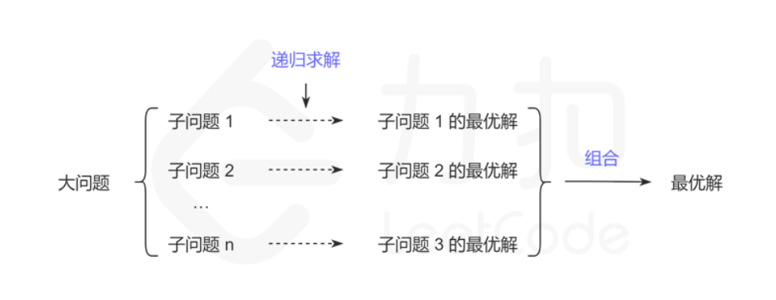

# 动态规划背景

&emsp;&emsp;动态规划(Dynamic programming,简称DP)是一种在数学、管理科学、计算机科学、经济学和生物信息学中使用的，通过把**原问题分解为相对简单的子问题的方式求解复杂问题**的方法。

&emsp;&emsp;动态规划不是某一种具体的算法，而是一种算法思想:**若要解一个给定问题，我们需要解其不同部分（即子问题），再根据子问题的解得出原问题的解**。

&emsp;&emsp;应用这种算法思想解决问题的可行性，对子问题与原问题的关系，以及子问题之间的关系这两方面有一些要求，它们分别对应了**最优子结构**和**重复子问题**。

1. **最优子结构**
&emsp;&emsp;**最优子结构规定的是子问题与原问题的关系**:动态规划要解决的都是一些问题的最优解，即从很多解决问题的方案中找到最优的一个。当我们在求一个问题最优解的时候，如果可以把这个问题分解成多个子问题，然后递归地找到每个子问题的最优解，最后通过一定的数学方法对各个子问题的最优解进行组合得到最终的结果。总结来说就是**一个问题的最优解是由它的各个子问题的最优解决定的**。
&emsp;&emsp;**将子问题的解进行组合可以得到原问题的解**是动态规划可行性的关键。在解题中一般用**动态转移方程**描述这种组合。例如原问题的解为$f(n)$,其中$f(n)$也叫状态。状态转移方程$f(n) = f(n-1) + f(n-2)$就描述了一种原问题与子问题的组合关系。在原问题上有一些选择，不同选择可能对应不同的子问题或者不同的组合方式。例如：

$$
f(n) = \begin{cases}
f(n-1) + f(n-2) & \text{n = 2k} \\
f(n-1) & \text{n = 2k+1}
\end{cases}
$$

$n=2k$和n=$2k+1$对应了原问题$n$上不同的选择，分别对应了不同的子问题和组合方式。**一旦找到了最优子结构，也就能推导出状态转移方程$f(n)$**,通过这个状态转移方程，我们就能很快的写出问题的递归实现方法。

2. **重复子问题**
&emsp;&emsp;**重复子问题规定的是子问题与子问题的关系**：当我们递归地寻找每个子问题的最优解的时候，有可能会重复地遇到一些更小的子问题，而且这些子问题会重叠地出现在子问题里，出现这样的情况，会有很多重复的计算，动态规划可以保证每个重叠的子问题只会被求解一次。**当重复的问题很多的时候，动态规划可以减少很多重复的计算**。
&emsp;&emsp;重复子问题不是保证解的正确性所必须的条件，但如果递归求解子问题时，没有出现重复子问题，则没有必要使用动态规划，直接使用递归就可以了。

&emsp;&emsp;解决动规规划问题的核心：**找出子问题及其子问题与原问题的关系**。找到了子问题以及原问题的关系，就可以递归地求解子问题了。但重叠的子问题使得直接递归会有很多重复计算，于是可以使用记忆化搜索对子问题的结果进行存储。因此，**一定程度上，记忆化搜索就等于动态规划**。

&emsp;&emsp;动态规划算法中关于最优子结构和重复子问题的理解的关键点：

- 证明问题的方案中包含一种选择，选择之后留下一个或多个子问题
- 设计子问题的递归描述方式
- 证明对原问题的最优解包括了对所有子问题的最优解
- 证明子问题是重叠的(**若原问题与子问题无重叠，则动态规划与递归的效率是一致的，就没必要使用动态规划了**)  
