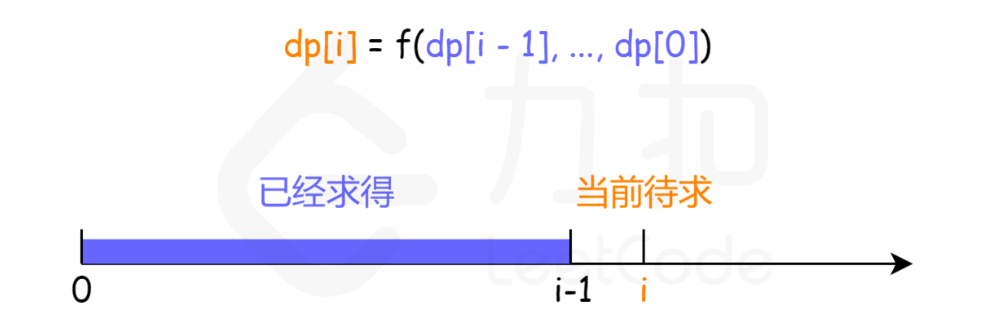
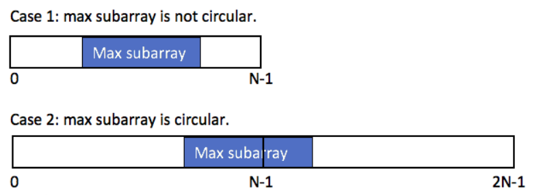
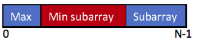

# 线性动态规划

&emsp;&emsp;线性动态规划的主要特点是：**状态的推导是按照问题规模$i$从小到大依次推导过去的，较大规模的问题的解依赖较小规模的问题的解**。这里问题规模$i$的含义是考虑前$i$个元素$[0,...,i]$时问题的解。由此可以看出，大规模问题的状态只与较小规模的问题有关，而问题规模完全用一个变量$i$表示，$i$的大小表示了问题规模的大小，因此从小到大推$i$直至$n$,就得到了大规模问题的解，这就是线性动态规划的过程。

&emsp;&emsp;线性动态规划解决的问题主要是**单串、双串、矩阵**上的问题。因为这些问题完全可以用位置表示，并且**位置的大小就是问题规模的大小**。因此从前往后推位置就相当于从小到大推问题规模。

## 单串问题

&emsp;&emsp;单串$dp[i]$线性动态规划最简单的一类问题，输入是一个串，状态定义为$dp[i] := 考虑[0,..,i]$上，原问题的解。其中$i$位置的处理，根据不同的问题，主要有两个方式:

- 第一种是$i$位置必须取，此时状态可以进一步描述为$dp[i] := 考虑[0,...,i]$上，且取$i$,原问题的解。
- 第二种是$i$位置可以取也可以不取。

&emsp;&emsp;线性DP中的单串$dp[i]$的问题，状态的推导方向以及推导公式如下：


1. **$dp[i]$依赖比$i$小的$O(1)$个子问题**
$dp[n]$只与常数个规模子问题有关，状态的推导过程$dp[i] = f(dp[i-1],dp[i-2],...)$。如上图所示，虽然紫色部分以及计算过了，但计算橙色所在状态时，仅需要用到$dp[i-1]$,这属于比$i$小的$O(1)$个子问题。

2. **$dp[i]$依赖比$i$小的$O(n)$个子问题**
$dp[n]$与此前的更小规模的所有子问题$dp[i-1],...,dp[0]$都可能有关系。如上图所示，计算橙色所在状态$dp[i]$时,紫色的此前计算过的状态$dp[i-1],...,dp[0]$均有可能用到，在计算$dp[i]$时，需要将它们再遍历一遍才能完成计算。其中$f$常见的有$max/min$,可能还需要对$i-1,...,0$有一些筛选条件，但推导$dp[i]$时依然是$O(n)$级子问题数量。

### LIS问题系列

&emsp;&emsp;LIS 是单串上最经典的问题，它的状态设计是单串动态规划最经典的状态设计。很多单串的题目。状态设计都是启发自这类题的设计。

1. **求最长上升子序列的长度**
给你一个整数数组 $nums$ ，找到其中**最长严格递增子序列**的长度。**子序列** 是由数组派生而来的序列，删除（或不删除）数组中的元素而不改变其余元素的顺序。

> 思路：

- 定义$dp[i]$为**考虑前$i$个元素，以第$i$个数字结尾的最长上升子序列的长度**
- 从小到大依次计算$dp$数组，在计算$dp[i]$之前，一定计算出了$dp[i-1],...,dp[0]$,因此状态转移方程为:
$$
dp[i] = max(dp[j]) + 1,\text{j∈[0,i-1] \& nums[i] > nums[j]}
$$
- 计算$dp$数组中最大值。


> 代码

```C++
class Solution {
public:
    int lengthOfLIS(vector<int>& nums) {
        int dp[2501];
        int len = nums.size();
        int ans = 0;
        for(int i=0;i<len;i++){
            // 最坏情况下，只有当前元素，子序列的长度为1
            dp[i] = 1;
            // 遍历0到i-1
            for(int j=0;j<i;j++){
                if(nums[i] > nums[j]){
                    dp[i] = max(dp[i],dp[j] + 1);
                }
            }
            // 求dp中的最大值
            ans = max(ans,dp[i]);
        }
        return ans;
    }
};
```

2. **求最长上升子序列的个数**
给定一个未排序的整数数组 nums ， 返回最长**严格单调递增**子序列的个数 。

>思路

- 额外定义一个数组$cnt[i]$,表示**以第$i$个元素结尾的最长上升子序列的个数**。
- 在求解最长上升子序列的过程中，计算个数即可。
- 最坏情况下，长度$dp[i]$和个数$cnt[i]$均为1.
- 当$dp[i] == dp[j]+1$时，$cnt[i]$ += $cnt[j]$
- 当$dp[j]+1 > dp[i]$时，意味着发现了更长的子序列，此时就需要更新:$cnt[i]$ = $cnt[j]$

> 代码

```C++
class Solution {
public:
    int findNumberOfLIS(vector<int>& nums) {
        int dp[2001],cnt[2001];
        int len = nums.size();
        int mx = 0;
        int ans;
        for(int i=0;i<len;i++){
            dp[i] = 1;
            cnt[i] = 1;
            for(int j=0;j<i;j++){
                if(nums[i] > nums[j]){
                    if(dp[i] < dp[j] + 1){
                        dp[i] = dp[j] + 1;
                        cnt[i] = cnt[j];
                    }else if(dp[i] == dp[j] + 1){
                        cnt[i] += cnt[j];
                    }
                }
            }
            // 更新最大长度及计数
            if(dp[i] > mx){
                mx = dp[i];
                ans = cnt[i];
            }else if(mx == dp[i]){
                ans += cnt[i];
            }
        }
        
        return ans;
    }
};
```

3. **俄罗斯套娃信封问题**
给你一个二维整数数组 $envelopes$ ，其中 $envelopes[i] = [wi, hi]$ ，表示第 $i$ 个信封的宽度和高度。当另一个信封的**宽度和高度都比这个信封大**的时候，这个信封就可以放进另一个信封里，如同俄罗斯套娃一样。请计算 最多能有多少个 信封能组成一组“俄罗斯套娃”信封（即可以把一个信封放到另一个信封里面）。
注意：不允许旋转信封。

> 思路

- 按照**宽度**或**高度**对$envelopes$数组进行从小到大的排序。
- 假设按照宽度进行了从小到大排序后。原问题就变成了**针对高度的最长上升子序列的长度**。
- $dp[i]$表示**第$i$个信封可以放入的最大信封数**。
- 则在按照宽度进行从小到大排序后，状态转移方程为：

$$
dp[i] = max(dp[j]) + 1,w_i>w_{i-1}恒成立，h_i > h_j
$$

```C++
class Solution {
public:
    int dp[100001] = {0};
    int maxEnvelopes(vector<vector<int>>& envelopes) {
        int n = envelopes.size();
        sort(envelopes.begin(), envelopes.end(),[](const auto& e1,const auto& e2){
            return e1[0] < e2[0] || (e1[0] == e2[0] && e1[1] > e2[1]);
        });
        int ans= 0;
        for(int i = 0;i<n;i++){
            dp[i] = 1;
            for(int j=0;j<i;j++){
                if(envelopes[i][1] > envelopes[j][1]){
                    dp[i] = max(dp[i],dp[j]+1);
                }
            }
            ans = max(ans,dp[i]);
        }
        return ans;
    }
};
```

### 最大子数组和系列

&emsp;&emsp;从动态规划角度讲，最大子数组和是以一类较简单的 DP 问题，但它的状态设计比较经典，同时也是很多问题的基础组件。

1. **最大子序和**
给你一个整数数组 $nums$ ，请你找出一个**具有最大和的连续子数组**（子数组最少包含一个元素），返回其最大和。子数组 是数组中的一个连续部分。

> 思路

- $dp[i]$表示**以i为结尾的连续子数组最大和**。
- 最坏情况下，最大和为$nums[i]$，因此状态转移方程如下：

$$
dp[i] = max(dp[i-1] + nums[i],nums[i])
$$

> 代码

```C++
class Solution {
public:
    int maxSubArray(vector<int>& nums) {
        int len = nums.size();
        vector<int> dp(len,0);
        dp[0] = nums[0];
        int ans = dp[0];
        // dp[i]表示以第i个元素结尾的最大和
        // dp[i] = max(nums[i],dp[i-1] + nums[i])
        for(int i=1;i<len;i++){
            dp[i] = max(nums[i],dp[i-1]+nums[i]);
            ans = max(ans,dp[i]);
        }
        return ans;
    }
};
```

2. **乘积最大子数组**
给你一个整数数组 $nums$ ，请你找出数组中**乘积最大的非空连续子数组**（该子数组中至少包含一个数字），并返回该子数组所对应的乘积。

> 思路

- 在该问题中，若状态转移方程定为最大和问题的状态转移方程一致$dp[i] = max(dp[i-1]*nums[i],nums[i])$,则在处理含负数的数组时，就不满足最优子结构。例如:$[-1,3,-2]$,若采用这个状态转移方程，则结果会求得：3，但实际答案为6。
- 因此需要两个数组$maxF，minF$分别存储最大、最小值积。可以将$minF$通俗理解为：**存储负值积**。
- 此时$maxF$、$minF$数组状态转移方程就可表示为：

$$
maxF[i] = max(maxF[i-1] * nums[i],minF[i-1]*nums[i],nums[i]) \\
minF[i] = min(maxF[i-1] * nums[i],minF[i-1]*nums[i],nums[i])
$$

- 最后返回$maxF$数组的最大值即可。

> 代码

```C++
class Solution {
public:
    int maxProduct(vector<int>& nums) {
        int len = nums.size();
        vector<int> minF(nums);
        vector<int> maxF(nums);
        int ans = nums[0];
        for(int i=1;i<len;i++){
            maxF[i] = max(maxF[i-1]*nums[i],max(minF[i-1]*nums[i],nums[i]));
            minF[i] = min(maxF[i-1]*nums[i],min(minF[i-1]*nums[i],nums[i]));
            ans = max(maxF[i],ans);
        }
        return ans;

    }
};
```

3. **环形子数组的最大和**

给定一个长度为 $n$ 的环形整数数组 $nums$ ，返回 $nums$ 的非空 子数组 的最大可能和 。环形数组 **意味着数组的末端将会与开头相连呈环状**。形式上， $nums[i]$ 的下一个元素是 $nums[(i + 1) \% n ]$ ， $nums[i]$ 的前一个元素是 $nums[(i - 1 + n) \% n]$ 。

> 分析

- 环形子数组的最大和子序列的分布共有两种情况:在**数组中间**和**头尾相连**
- 对于第一种情况：$currList_{max} = List_{max}$

- 对于第二种情况，可以证明:$currList_{max} = List_{sum} - List_{min}$

    > 证明：
    $max(Max+Subarray) = max(sum - MinSubarray) = sum - min(MinSubarray)$。其中，$MinSubarray$是数组中最小和子数组。
- 在第二种情况下,需要注意的是：当数组中的元素全为负数，此时$List_{sum} == List_{min}$,在这种情况下，$currList_{max}$会被错误计算为0，但实际上答案是**数组中最大的元素**(最大子序列，**这种情况下，最大子序列只能为数组中的最大元素了**)
- 综合两种情况，返回最大值:$currList_{max} = max(List_{max},List_{sum} - List_{min})$

> 代码

```C++
class Solution {
public:
    int maxSubarraySumCircular(vector<int>& nums) {
        int n = nums.size();
        vector<int> maxL(nums);
        vector<int> minL(nums);
        int sum = 0;
        for(auto e:nums){
            sum += e;
        }
        // mx = Listmax, mi = Listmin
        int mx = nums[0], mi = nums[0];
        for(int i=1;i<n;i++){
            maxL[i] = max(maxL[i-1] + nums[i],maxL[i]);
            mx = max(maxL[i],mx);
            minL[i] = min(minL[i-1] + nums[i],minL[i]);
            mi = min(minL[i],mi);
        }
        return mx < 0 ? mx : max(mx,sum - mi);
    }
};
```

4. **最大子矩阵和**
给定一个正整数、负整数和 0 组成的 $N × M$ 矩阵，编写代码找出元素总和最大的子矩阵。
返回一个数组 $[r1, c1, r2, c2]$，其中 $r1, c1$ 分别代表子矩阵左上角的行号和列号，$r2, c2$ 分别代表右下角的行号和列号。若有多个满足条件的子矩阵，返回任意一个均可。

> 思路

- 回顾一维的最大子数组和，我们可以根据如下代码求出最大和的子数组的起始位置和结尾位置。

```C++
class Solution {
public:
    vector<int> maxSubArray(vector<int>& nums) {
        int maxsum=INT_MIN;
        int dp = INT_MIN;
        vector<int> ans(2);//用来记录答案
        int start = 0;
        for(int i=0 ; i < nums.size() ; i++ ){
            if( dp > 0 ){    //dp > 0 时，不断累加就行，因为正数越加越大
                dp += nums[i];
            }
            else{              //dp < 0时,意味着不断求和中断，此时起始位置更新为求和中断所在位置
                dp = nums[i];
                start = i;     
            }
            if(dp > maxsum){// 只有找到更大的值，才更新答案
                maxsum = dp;
                ans[0] = start;//记录下起始和终止位置
                ans[1] = i;
            }  
        }
        return ans;
    }
};
```

- 在了解完一维最大和子数组的起始和结尾位置的求法后，我们就可以尝试在二维里进行求解了。首先不难想到要实现**降维**，如何降维？我们可以将每一列的元素进行求和$sumOfCol$,数组$sumOfCol[row][col]$表示**第$col$列，从第$0$行到第$row$行的累加和**。
- 设$dp$为第$r1$行到$r2$行的累加和,则：

$$
dp[col] = \begin{cases}
    sumOfCol[row][col],& \text{row = 0,} \\
    sumOfCol[r2][col] - sumOfCol[r1-1][col],& \text{row > 0}
\end{cases}
$$

- 因此求矩阵中和最大的子矩阵，只需要在所有可能的$dp$数组中找到和最大子数组即可。假设所有可能的$dp$数组中最大和子数组的起始位置为$c1$,结尾位置为$c2$,则最大和子矩阵的位置为:{$r1,c1,r2,c2$}


> 代码

```C++
class Solution {
public:
    vector<int> getMaxMatrix(vector<vector<int>>& matrix) {
        int r = matrix.size();
        int c = matrix[0].size();
        int sumOfCol[r][c],dp[c];
        memset(sumOfCol,0,sizeof(sumOfCol));
        
        // 求0到row的累加和
        for(int i=0;i<r;i++){
            for(int j=0;j<c;j++){
                if(i == 0){
                    sumOfCol[i][j] = matrix[i][j];
                }else{
                    sumOfCol[i][j] = sumOfCol[i-1][j] + matrix[i][j];
                }
            }
        }

        // maxSum是最大子矩阵和
        int maxSum = INT_MIN;
        vector<int> ans({0,0,0,0});

        for(int r1=0;r1<r;r1++){
            for(int r2 = r1;r2<r;r2++){
                memset(dp, 0, sizeof(dp));
                // 求dp数组
                for(int c2 =0;c2<c;c2++){
                    if(r1 == 0){
                        dp[c2] = sumOfCol[r2][c2];
                    }else{
                        dp[c2] = sumOfCol[r2][c2] - sumOfCol[r1-1][c2];
                    }
                }
                // 在dp数组上找到最大和子数组的起始和结束索引
                // t是dp数组上子数组的最大和
                int c1=0,t=INT_MIN;
                for(int c2 = 0;c2 < c;c2++){
                    if(t > 0){
                        t += dp[c2]; 
                    }else{
                        t = dp[c2];
                        c1 = c2;
                    }    
                    // 如果找到了更大的和，则更新位置
                    if(t > maxSum){
                        maxSum = t;
                        ans = {r1,c1,r2,c2};
                    }
                }
            }
        }
        return ans;
    }
};
```

### 不相邻子序列的最大和问题

1. **打家劫舍(线形)**
你是一个专业的小偷，计划偷窃沿街的房屋。每间房内都藏有一定的现金，影响你偷窃的唯一制约因素就是相邻的房屋装有相互连通的防盗系统，如果两间相邻的房屋在同一晚上被小偷闯入，系统会自动报警。
给定一个代表每个房屋存放金额的非负整数数组，计算你 **不触动警报装置的情况下** ，一夜之内能够偷窃到的最高金额。

> 思路

- 一个小偷要偷线性排列的房屋，若**偷相邻的房屋，则会触发警报**。求在不触发报警的前提下，能偷到的最大金额。
- 不触发警报，意味着要隔着偷：**偷了当前房屋，下一个挨着的房屋就不能偷**。因此针对每一个房屋，可做出的决策是**偷**与**不偷**。在不偷的情况下,其实就是**忽略**偷这房屋。
- 设$dp[i]$表示：**偷前i栋房屋得到的最大收益**
- 考虑前i栋房屋的最大收益，就需要考虑**前i-2栋的最大收益加上第i栋房屋的价值**（i-2栋房屋与第i栋房屋相隔，可以选择）和**前i-1栋的最大收益**(因为i-1栋房屋与第i栋房屋相邻，所以不能偷)。
- 状态转移方程：
$$
    dp[i] = max(dp[i-2]+nums[i-1],dp[i-1])
$$
其中，$nums[i-1]$是因为$i$从下标$0$开始,因此不应该写$nums[i]。$而$dp$需要取到$dp[n]$,因为$dp[i]$考虑的是前$i$栋房屋的最大价值，所以最终遍历到$n$而非$n-1$。
- 为防止下标越界，需要手动将$dp[0]$和$dp[1]$计算出来作为初始值。
  - $dp[0] = 0$:考虑偷前0栋房子的最大收益，则收益自然是$0$。
  - $dp[1] = nums[0]$:考虑偷前1栋房子的最大收益，则收益自然是这唯一可偷房子的价值

> 代码

```C++
class Solution {
public:
    int rob(vector<int>& nums) {
        int n = nums.size();
        int dp[n+1];
        memset(dp, 0, sizeof(dp));
        dp[0] = 0;
        dp[1] = nums[0];
        for(int i=2;i<=n;i++){
            dp[i] = max(dp[i-2] + nums[i-1],dp[i-1]);
        }
        return dp[n];
    }
};
```

2. **打家劫舍(环形)**
你是一个专业的小偷，计划偷窃沿街的房屋，每间房内都藏有一定的现金。这个地方所有的房屋都 **围成一圈** ，这意味着第一个房屋和最后一个房屋是紧挨着的。同时，相邻的房屋装有相互连通的防盗系统，如果两间相邻的房屋在同一晚上被小偷闯入，系统会自动报警 。
给定一个代表每个房屋存放金额的非负整数数组，计算你 在不触动警报装置的情况下 ，今晚能够偷窃到的最高金额。

> 思路

- 该题和上题类似，唯一不同的就是**房屋的排列不再是线性，而是环形**。因此，你偷了第一栋房子就不能偷最后一栋房子，你不偷第一栋房子，最后一栋房子就可以偷。
- 针对上述结论，我们可以得到**两种线性**情况(假设房子编号：1~N)：
  - 第1栋房子偷，则能偷的范围是$1->N-1$
  - 第N栋房子偷，则能偷的范围是$2->N$
- 据此，我们就只需要求两次线性打家劫舍问题的结果，而两种结果的最大值就是环形的最大收益。

> 代码

```C++
class Solution {
public:
    int rob(vector<int>& nums) {
        // 针对最后一个房子，有两种情况：偷与不偷
        // 当最后一个偷时，第一个房子就不应该偷，此时就是求房子2到N的最大可偷价值
        // 当最后一个不偷时，第一个房子就可以选择偷，此时就是求房子1到N-1的最大可偷价值
        // f[i] = max(f[i-2] + nums[i-1],f[i-1]);

        int n = nums.size();
        if(n==1){
            return nums[0];
        }
        int f[n];
        memset(f, 0, sizeof(f));
        // 先计算2-N
        vector<int> t(nums.begin()+1,nums.end());
        f[1] = t[0];
        
        for(int i=2;i<=n-1;i++){
            f[i] = max(f[i-2] + t[i-1],f[i-1]);
        }

        int ans = f[n-1];
        // 再计算1-(N-1)
        t = vector<int>(nums.begin(),nums.begin()+(n-1));
        f[1] = t[0];
        
        for(int i=2;i<=n-1;i++){
            f[i] = max(f[i-2] + t[i-1],f[i-1]);
        }
        // 返回两种情况的最大值
        return max(f[n-1],ans);
    }
};
```

3. **删除与获得点数**
给你一个整数数组 $nums$ ，你可以对它进行一些操作。
每次操作中，选择任意一个 $nums[i]$ ，删除它并获得 $nums[i]$ 的点数。之后，你必须删除 所有 等于 $nums[i] - 1$ 和 $nums[i] + 1$ 的元素。
开始你拥有 0 个点数。返回你能通过这些操作获得的最大点数。

> 思路

- 给定一个数组对其进行操作，**若选择数组元素$x$，则$x-1$和$x+1$的元素不能选择**。若存在多个元素$x$，自然是要将$x$都选上以获得更大点数。
- 通过上述加粗部分，我们可以很容易想到打家劫舍的题。房屋编号就是数组元素所代表的值，房屋价值就是**数组元素乘以该元素出现的次数**。
- 易得，房屋的编号范围：$[0,max\{nums.begin(),nums.end()\}]$
- 定义数组$cnt$,$cnt[i]$表示**数字$i$在$nums$中出现的次数**。
- 定义数组$dp$,$dp[i]$表示**前$i$个数可获得的最大点数**
- 状态转移方程：
$$
dp[i] = max(dp[i-2] + cnt[i]*i, dp[i-1])
$$
- 初始状态
  - $dp[0] = 0$
  - $dp[1] = cnt[1] * 1$;

> 代码

```C++
class Solution {
public:
    int deleteAndEarn(vector<int>& nums) {
        int n = nums.size();
        // nums的最大值
        int Max = *max_element(nums.begin(), nums.end());
        
        int cnt[Max+1],dp[Max+1];
        memset(cnt, 0, sizeof(cnt));
        memset(dp, 0, sizeof(dp));

        // 计数
        for(auto e:nums){
            cnt[e]++;
        }
        
        // 动规
        dp[0] = 0;
        dp[1] = cnt[1];
        for(int i=2;i<=Max;i++){
            dp[i] = max(dp[i-2] + cnt[i]*i,dp[i-1]);
        }
        
        // 返回前Max数可获得的最大价值
        return dp[Max];
    }
};
```

4. **3n 块披萨**
给你一个披萨，它由 3n 块不同大小的部分组成，现在你和你的朋友们需要按照如下规则来分披萨：
   - 你挑选 任意 一块披萨。
   - Alice 将会挑选你所选择的披萨逆时针方向的下一块披萨。
   - Bob 将会挑选你所选择的披萨顺时针方向的下一块披萨。
   - 重复上述过程直到没有披萨剩下。

    每一块披萨的大小按顺时针方向由循环数组 slices 表示。
    请你返回你可以获得的披萨大小总和的最大值。

> 思路

- 原题可以转换为：在一个长为$3n$的环形序列，从中选$n$个互不相邻的数，返回这$n$个数的最大值。
- 对于环状序列，我们可以先考虑线性序列如何求解。依据题意，每个问题我们至少需要两种状态：**序列长度**和**选的个数**。
- 设二维数组$dp$,$dp[i][j]$表示**前$i$个数中选$j$个互不相邻的数的最大价值**。
- 据此，可以推出$dp[i][j]$的状态来自两处：
  - 选第i个数，则第i-1个数不可选，状态来自前i-2个数中选j-1个数的最大价值+第$i$个数的值，即：
  $$
  dp[i][j] = dp[i-2][j-1] + nums[i]
  $$
  - 不选第$i$个数,则需要从前$i-1$个数中选$j$个数，因此：
  $$
  dp[i][j] = dp[i-1][j]
  $$
- 再取两种情况的最大值，即：
$$
dp[i][j] = max(dp[i-2][i-1] + nums[i],dp[i-1][j])
$$
- 上述推导均是基于线性序列，而对于环形序列，其实就只需要计算两次线性序列即可(参考打家劫舍（环形）)。
- 初始条件：
  - $dp[0][j] = 0,j=1,2,...,n$
  - $dp[1][j] = nums[0],j=1,2,...,n$

> 代码

```C++
class Solution {
public:
    int maxSizeSlices(vector<int>& slices) {
        vector<int> t = vector<int>(slices.begin()+1,slices.end());
        int ans1 = getAns(t);
        t = vector<int>(slices.begin(),slices.end()-1);
        int ans2 = getAns(t);
        return max(ans1,ans2);

    }

    int getAns(vector<int> slices){
        int n = slices.size();
        // n+1是因为传进来的序列少了一个
        int choose = (n+1) / 3;

        // 初始化
        vector<vector<int>> dp(n+1,vector<int>(choose+1,0));
        for(int i=1;i<=choose;i++){
            dp[1][i] = slices[0];
        }

        // 计算
        for(int i=2;i<=n;i++){
            for(int j=1;j<=choose;j++){
                dp[i][j] = max(dp[i-1][j],dp[i-2][j-1] + slices[i-1]);
            }
        }
        return dp[n][choose];
    }
};
```
