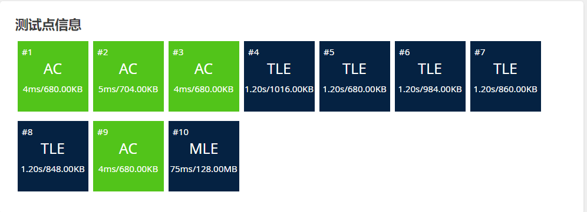
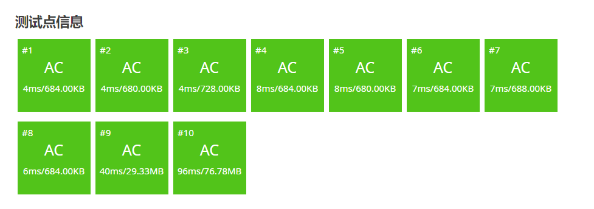

# 背包问题

## 1. 最优载问题

#### 题目描述
>
> 给出n个物体，第i个物体重量为Wi。选择尽量多的物体，使得总重量不超过C。

> 分析：由于只关心物体的数量，所以装重的没有装轻的划算。只需把所有物体按重量从小到大排序，依次选择每个物体，直到装不下为止。这是一种典型的贪心策略，它只顾眼前，但却能得到最优解。

```C++
#include<bits/stdc++.h>
using namespace std;

int main()
{
    int n,c,sum=0;
    int w[n+1];
    for(int i=1;i<=n;i++){
        cin>>w[i];
    }
    sort(w+1,w+n+1);
    int i=1;
    while(sum <= c && i < n){
        sum += w[i];
        i++;
    }
    cout << i-1 <<endl;
    return 0;
}
```

## 2. 部分背包问题
>
> 有n个物体，第i个物体的重量为Wi，价值为Vi。在总重量不超过C的情况下让总价值尽可能的高。每一个物体都可以只取走一部分，价值和重量按比例计算。

> &nbsp; &nbsp; &nbsp; &nbsp;该问题最直观的贪心策略就是：优先拿"价值/重量的值"最大的，直到最终的重量和正好为C。
> &nbsp; &nbsp; &nbsp; &nbsp;由于每个物体可以只拿一部分，因此一定可以让总重量恰好为C，而且除了最后一个以外，所有的物体要么不拿，要么全拿走。

#### 题目描述

阿里巴巴走进了装满宝藏的藏宝洞。藏宝洞里面有 $N(N \le 100)$ 堆金币，第 $i$ 堆金币的总重量和总价值分别是 $m_i,v_i(1\le m_i,v_i \le 100)$。阿里巴巴有一个承重量为 $T(T \le 1000)$ 的背包，但并不一定有办法将全部的金币都装进去。他想装走尽可能多价值的金币。所有金币都可以随意分割，分割完的金币重量价值比（也就是单位价格）不变。请问阿里巴巴最多可以拿走多少价值的金币？

#### 输入格式

第一行两个整数 $N,T$。

接下来 $N$ 行，每行两个整数 $m_i,v_i$。

#### 输出格式

一个实数表示答案，输出两位小数

#### 样例 #1

##### 样例输入 #1

```
4 50
10 60
20 100
30 120
15 45
```

#### 样例输出 #1

```
240.00
```

#### AC代码

```C++
#include<bits/stdc++.h>

using namespace std;

// 定义每个物体的结构体
struct Node{
    int m,v;
}arrs[105];
// 排序规则：按照性价比进行排序
bool cmp(Node a,Node b){
    return a.v*1.0/a.m*1.0 > b.v*1.0/b.m*1.0;
}

int main()
{
    int n,t;
    cin>>n>>t;
    for(int i=1;i<=n;i++){
        cin>>arrs[i].m>>arrs[i].v;
    }
    double sum = 0;
    sort(arrs+1,arrs+1+n,cmp);
    for(int i=1;i<=n;i++){
        // 只要能拿，就全拿走
        if(arrs[i].m <= t){
            sum += arrs[i].v;
            t -= arrs[i].m;
        }else{
            // 无法全拿走时，那满可以拿走的部分，并直接跳出
            sum += arrs[i].v*1.0 / arrs[i].m*1.0 * t;
            break;
        }
    }
    printf("%.2f",sum);
    return 0;
}

```

## 3. 0-1背包问题

#### 题目描述
>
> 有n种物品，每种只有一个。第i种物品的体积为Vi，重量为Wi。选一些物品装到一个容量为C的背包中，使得背包在内的物品在总体积不超过C的前提下重量尽量大。

> 0-1背包问题的一个特征就是：在面对一个物品时，有两种选择：拿和不拿，不能装入某个物品的一部分(不具有部分背包特征),也不能装入一个物品多次。

##### (1) 暴力递归进行求解

```C++
#include<bits/stdc++.h>

using namespace std;

// 当前考虑index号货物，index...所有的货物可以自由选择
// 做的选择不能超过背包容量
// 返回最大价值
int process(int w[],int v[],int index,int pag,int n){
    // 如果pag<0,说明当前策略不可选
    if(pag<0){
        return -1;
    }
    // 如果index == n，选择的是不存在的物品
    if(index == n){
        return 0;
    }
    // 两种决策：选和不选
    // 当前index物品，做出不选的决策，考虑下一个物品(index+1)的决策
    int p1 = process(w,v,index+1,pag,n);
    int p2 = 0;
    if(pag - w[index] >= 0){
        // 选择当前index物品，则它的价值 = 当前物品的价值 + 针对下一个物品做出的决策返回的最大价值
        p2 = v[index] + process(w,v,index+1,pag-w[index],n);
    }
    // 返回两种决策的最大价值
    return max(p1,p2);
}

// 所有的货，重量和价值，都在W和V数组里
// 为了方便，没有负数
// pag为背包最大容量，不能超过该载重
// 返回：不超重的情况下，能够得到的最大价值
int maxValue(int w[],int v[],int pag,int n){
    return process(w,v,0,pag,n);
}
int main()
{
    int w[] = {3,2,4,7,3,1,7};
    int v[] = {5,6,3,19,12,4,2};
    int bag = 15;
    cout<<maxValue(w,v,bag,7)<<endl;
    return 0;
}
```

##### (2) 动态规划进行求解
>
> 参数：index,pag决定每次做决策的状态
> 依据上述实现的暴力递归，我们可以对每个决策进行优化

```C++
#include<bits/stdc++.h>
using namespace std;

int maxValue_dp(int w[],int v[],int pag,int n){
    int dp[n+1][pag+1] = {0};
    // index == n时，价值为0(由暴力递归的分支代码决定)。数组在初始化的时候，就默认为0了
    for(int index = n-1;index>=0;index--){
        for(int rest = 0;rest<=pag;rest++){
            // 针对当前物品，决策为不选。
            int p1 = dp[index+1][rest];
            // 针对当前物品，决策为选。
            int p2 = 0;
            int next = rest - w[index] < 0 ? -1 : dp[index+1][rest-w[index]];
            // 如果next == -1，说明选当前物品，是一个无效的决策
            if(next!=-1){
                p2 = v[index] + next;
            }
            // 当前决策的解为两种情况的最大值
            dp[index][rest] = max(p1,p2);
        }
    }
    // 返回所求
    return dp[0][pag];
}

int main()
{
    int w[] = {3,2,4,7,3,1,7};
    int v[] = {5,6,3,19,12,4,2};
    int bag = 15;
    cout<<maxValue_dp(w,v,bag,7)<<endl;
    return 0;
}
```

##### 0-1背包的朴素代码模板

```C++
int dp[N+1][pag+1];
for(int index = n-1;index>=0;index--){
        for(int rest = 0;rest<=pag;rest++){
            /*
            int p1 = dp[index+1][rest];
            int p2 = 0;
            int next = rest - w[index] < 0 ? -1 : dp[index+1][rest-w[index]];
            if(next!=-1){
                p2 = v[index] + next;
            }
            dp[index][rest] = max(p1,p2);
            */
            // 将上述代码优化成下述代码
            if(rest - w[index] < 0){
                dp[index][rest] = dp[index+1][rest];
            }else{
                dp[index][rest] = max(dp[index+1][rest],dp[index+1][rest-w[index]]);
            }
        }
}
return dp[1][pag];
```
>
> - 可以发现，返回时的dp表的下标参数，有一个是固定值，因此可以对dp表进行压缩，压缩为1维表。
> - 需要采用逆向递推，如果正向执行正向递推的话，顶层那部分会因底层不断向下推而不断改变。

##### 0-1背包的最终代码模板

```C++
for(int index = 1; index <= N;index++){
        // 逆向递推
        for(int rest = W; rest>=0; rest--){
            if(rest >= w[index]){
                dp[rest] = max(dp[rest],dp[rest-w[index]]+v[index]);
            }
        }
}
return dp[W];
```

## 4. 完全背包问题
>
> 有N种物品和一个容量为C的背包，每种物品都有无限件。第i件物品的体积是V[i],价值是W[i]。求解将哪些物品装入背包可使得这些物品的费用总和不超过背包容量，且价值总和最大。

> 分析：其实就是在0-1背包问题的基础上，增加了每件物品可以选择多次的特点(在背包容量允许的情况下)

#### 题目描述

医师把小孩带到一个到处都是草药的山洞里对他说：“孩子，这个山洞里有一些不同种类的草药，采每一种都需要一些时间，每一种也有它自身的价值。我会给你一段时间，在这段时间里，你可以采到一些草药。如果你是一个聪明的孩子，你应该可以让采到的草药的总价值最大。”

如果你是小孩，你能完成这个任务吗？

$1$. 每种草药可以无限制地疯狂采摘。

$2$. 药的种类眼花缭乱，采药时间好长好长啊！师傅等得菊花都谢了！

#### 输入格式

输入第一行有两个整数，分别代表总共能够用来采药的时间 $t$ 和代表山洞里的草药的数目 $m$。

第 $2$ 到第 $(m + 1)$ 行，每行两个整数，第 $(i + 1)$ 行的整数 $a_i, b_i$ 分别表示采摘第 $i$ 种草药的时间和该草药的价值。

#### 输出格式

输出一行，这一行只包含一个整数，表示在规定的时间内，可以采到的草药的最大总价值。

#### 样例 #1

##### 样例输入 #1

```
70 3
71 100
69 1
1 2
```

#### 样例输出 #1

```
140
```

#### 提示

#### 数据规模与约定

- 对于 $30\%$ 的数据，保证 $m \le 10^3$ 。
- 对于 $100\%$ 的数据，保证 $1 \leq m \le 10^4$，$1 \leq t \leq 10^7$，且 $1 \leq m \times t \leq 10^7$，$1 \leq a_i, b_i \leq 10^4$。

##### (1) 正常思维的暴力递归

```C++
#include<bits/stdc++.h>

using namespace std;

struct Node{
    int t,v;
}arrs[10005];

int tt,m;

int process(int index,int t){
    if(index > m){
        return 0;
    }
    // 不摘这株药
    int p1 = process(index+1,t);
    // 摘这株药：下一步决策 选择摘下一株 或 选择继续摘这株
    int p2 = 0,p3=0;
    if(t-arrs[index].t >=0 ){
        // 选择摘下一株
        p2 = arrs[index].v + process(index+1,t-arrs[index].t);
        // 选择继续摘这株
        p3 = arrs[index].v + process(index,t-arrs[index].t);
    }
    // 返回三种决策的最大值
    return p1>p2? (p1>p3? p1:p3) : (p2>p3?p2:p3);
}

int main()
{
    cin>>tt>>m;
    for(int i=1;i<=m;i++){
        cin>>arrs[i].t>>arrs[i].v;
    }
    cout<<process(1,tt)<<endl;

    return 0;
}
```



##### (2) 记忆化搜索

```C++
#include<bits/stdc++.h>

using namespace std;

struct Node{
    int t,v;
}arrs[10005];

int tt,m;

// 缓存表 ---> 题目的数据范围过于庞大，空间是无法开辟出来的
long long dp1[10005][10000003];
long long process(int index,int t){
    // 如果已经计算过了
    if(dp1[index][t] != -1){
        return dp1[index][t];
    }
    long long ans = 0;
    if(index > m){
        dp1[index][t] = ans;
        return ans;
    }
    // 不摘这株药
    long long p1 = process(index+1,t);
    // 摘这株药：下一步决策 选择摘下一株 或 选择继续摘这株
    long long p2 = 0,p3=0;
    if(t-arrs[index].t >=0 ){
        // 选择摘下一株
        p2 = (long long)arrs[index].v + process(index+1,t-arrs[index].t);
        // 选择继续摘这株
        p3 = (long long)arrs[index].v + process(index,t-arrs[index].t);
    }
    // 返回三种决策的最大值
    ans = p1>p2? (p1>p3? p1:p3) : (p2>p3?p2:p3);
    dp1[index][t] = ans;
    return ans;
}
int main()
{
    cin>>tt>>m;
    for(int i=1;i<=m;i++){
        cin>>arrs[i].t>>arrs[i].v;
    }
    for(int i=0;i<=m;i++){
        for(int j=0;j<=tt;j++){
            dp1[i][j] = -1;
        }
    }

    cout<<process(1,tt)<<endl;

    return 0;
}
```

##### (3) 优化过程
>
> 在本题中，数据范围过于庞大，开辟10000 * 10000000的空间非常不合理，因此采用记忆化搜索方法是不切实际的。我们可以依据0-1背包中的动态规划代码进行修改：

> 0-1背包代码模板：

```C++
int dp[pag+1];
for(int index = 0; index < n;index++){
        // 逆向递推
        for(int rest = pag;rest>=0;rest++){
            if(rest >= w[index]){
                dp[rest] = max(dp[rest],dp[rest-w[index]]+v[index]);
            }
        }
}
return dp[pag];
```

>
```C++
#include<bits/stdc++.h>

using namespace std;

struct Node{
    int t,v;
}arrs[10005];

int tt,m;

long long dp[10000005];

long long ans_dp(){
    // 表在输入的时候是从下标1开始输入的，因此遍历也从1开始
    for(int index = 1;index <= m;index++){
        for(int rest = tt;rest>=0;rest--){
            // 用K表示取的个数，k的范围：(0 - 可用背包容量/当前物品的容量)
            for(int k=0;k<=(rest/arrs[index].t);k++){
                if(rest >= k * arrs[index].t){
                    dp[rest] = max(dp[rest],dp[rest- k*arrs[index].t] + k*arrs[index].v);
                }
            }
        }
    }
    return dp[tt];

}

int main()
{
    cin>>tt>>m;
    for(int i=1;i<=m;i++){
        cin>>arrs[i].t>>arrs[i].v;
    }
    cout<<ans_dp()<<endl;

    return 0;
}
```


> 显而易见的是，三层循环的时间复杂度较高,因此需要对原代码进行优化:
>
> - 因为每件物品可以无限拿，如果采用逆向递推，底层的dp表值就会根据你不断上推的过程进行改变
> - 采用顺向递推，顶层的值不会根据你不断向下递推而改变

#### AC代码

```C++
#include<bits/stdc++.h>

using namespace std;

struct Node{
    int t,v;
}arrs[10005];

int tt,m;

long long dp[10000005];

long long ans_dp(){
    for(int index = 1;index <= m;index++){
        /*
        for(int rest = 0;rest<=tt;rest++){// 顺向递推
            if(rest>=arrs[index].t){ // 如果当前物品可以拿，针对当前表，可以获得当前拿和不拿两种决策的最大价值
                dp[rest] = max(dp[rest],dp[rest-arrs[index].t] + arrs[index].v);
            }
        }
            上述内层for循环代码进行压缩后得到如下代码:
        */
        for(int rest = arrs[index].t;rest<=tt;rest++){// 顺向递推
            dp[rest] = max(dp[rest],dp[rest-arrs[index].t] + arrs[index].v);
        }
    }
    return dp[tt];

}

int main()
{
    cin>>tt>>m;
    for(int i=1;i<=m;i++){
        cin>>arrs[i].t>>arrs[i].v;
    }
    cout<<ans_dp()<<endl;

    return 0;
}
```



##### 完全背包问题的代码模板

```C++
for(int index = 1;index <= N;index++){
    for(int rest = w[index]; rest<=W; rest++){
        // w数组代表物品的权值 v数组代表物品的价值
        dp[rest] = max(dp[rest],dp[rest-w[index]] + v[index]);
    }
}
return dp[W];
```

## 二维费用背包
>
> 有N件物品和一个容量是V的背包，背包能承受的最大重量是M。每件物品只能用一次，体积是ai,重量是bi,价值是wi。求解将哪些物品装入背包，可使物品总体积不超过背包容量，总重量不超过背包可承受的最大重量，且价值总和最大，并输出最大价值。

分析:
> 对于每件物品，具有两种不同的费用，即选和不选
> 选择这件物品必须同时付出这两种代价，即bi和wi
> 对于每种代价都有一个可付出的最大值，即背包需要能够装下

观察0-1背包未压缩时的状态转移方程:

```C++
// j为代价，即重量
dp[i][j] = max(dp[i-1][j], dp[i-1][j - a[i]]+w[i])
```

> 对此，我们设dp[i][j][k],意义为: 取第i个物品的情况下，双重循环遍历每一个代价j和k时的最大价值

```C++
dp[i][j][k] = max(dp[i-1][j][k],dp[i-1][j-a[i]][k-b[i]]+w[i]);
```

进行状态压缩后:

```C++
dp[j][k] = max(dp[j][k],dp[j-a[i]][k-b[i]]+w[i]);
```

#### 例题: NASA的食物计划

#### 题目描述

航天飞机的体积有限，当然如果载过重的物品，燃料会浪费很多钱，每件食品都有各自的体积、质量以及所含卡路里。在告诉你体积和质量的最大值的情况下，请输出能达到的食品方案所含卡路里的最大值，当然每个食品只能使用一次。

#### 输入格式

第一行 $2$ 个整数，分别代表体积最大值 $h$ 和质量最大值 $t$。

第二行 $1$ 个整数代表食品总数 $n$。

接下来 $n$ 行每行 $3$ 个数 体积 $h_i$，质量 $t_i$，所含卡路里 $k_i$。

#### 输出格式

一个数，表示所能达到的最大卡路里（`int` 范围内）

#### 样例 #1

##### 样例输入 #1

```
320 350
4
160 40 120
80 110 240
220 70 310
40 400 220
```

##### 样例输出 #1

```
550
```

#### 提示

对于 $100\%$ 的数据，$h,t,h_i,t_i \le 400$，$n \le 50$，$k_i \le 500$。

```C++
#include<bits/stdc++.h>

using namespace std;
int h,t,n;

struct Node{
    int h,t,k;
}arrs[60];
int dp[1005][505];

int main()
{
    cin >> h >> t;
    cin >> n;
    for(int i=1;i<=n;i++){
        cin >> arrs[i].h >> arrs[i].t >> arrs[i].k;
    }
    // 二重背包代码
    for(int i=1;i<=n;i++){
        for(int j=h;j>=arrs[i].h;j--){
            for(int k=t;k>=arrs[i].t;k--){
                dp[j][k] = max(dp[j][k],dp[j-arrs[i].h][k-arrs[i].t] +arrs[i].k);
            }
        }
    }
    cout << dp[h][t] << endl;
    return 0;
}
```
