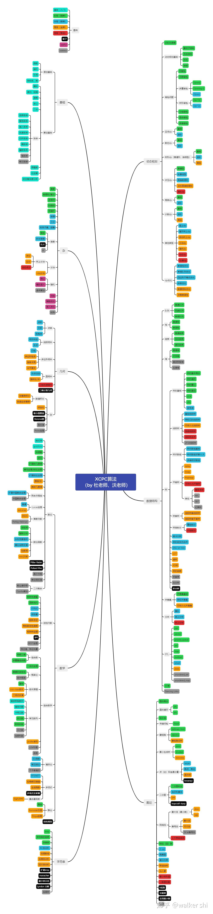

# 注意

移动端不支持Latex渲染，会导致文本中掺杂一些"\()"符号，建议使用PC端浏览！！！

## 已完结

**DFS、BFS、拓扑排序、背包问题、并查集、快速幂、DP入门**

## 更新中

**DP进阶、前缀和、堆、....、根本学不完o(╥﹏╥)o**

 [GitHub项目地址](https://github.com/2043393364/Algorithm-Competition)

 [OJ竞赛学习网站](https://oi-wiki.org/)

## 学习路线

 
